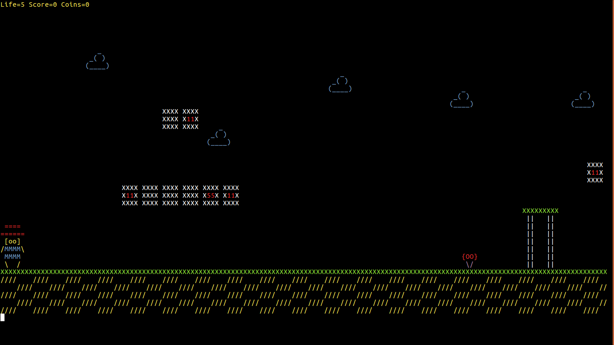
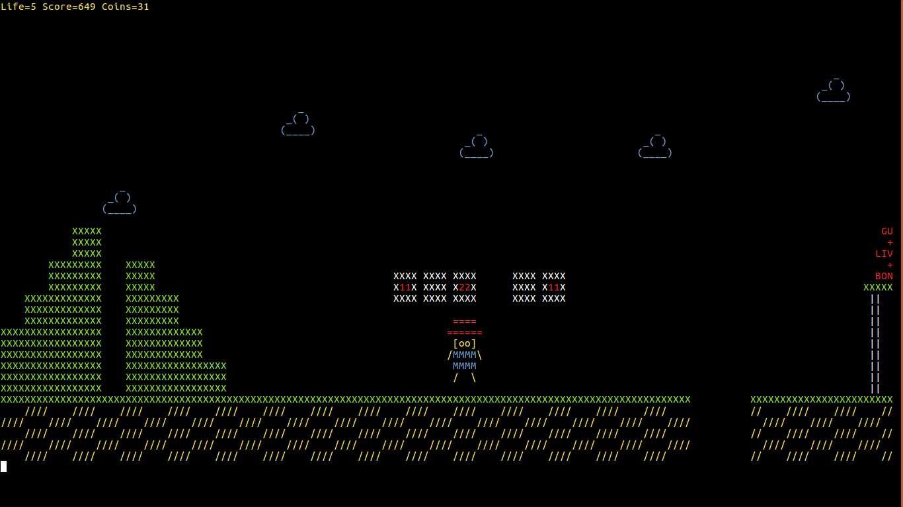
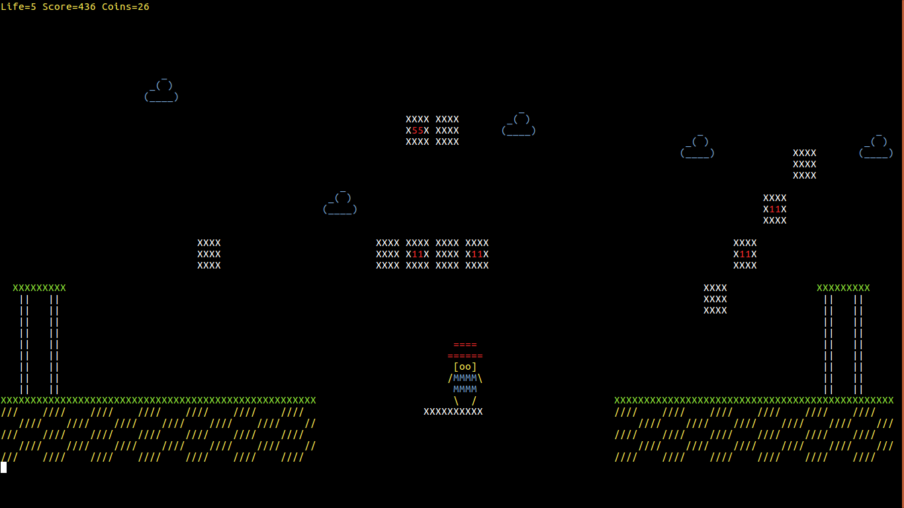
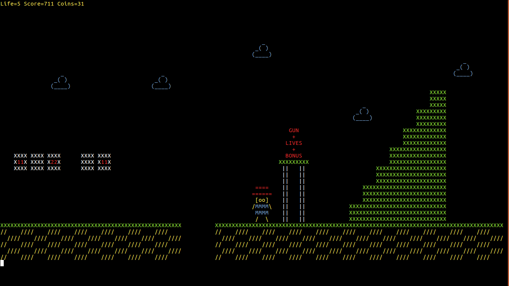
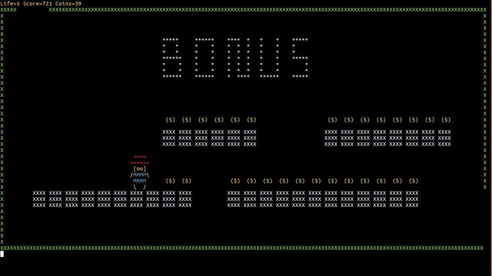
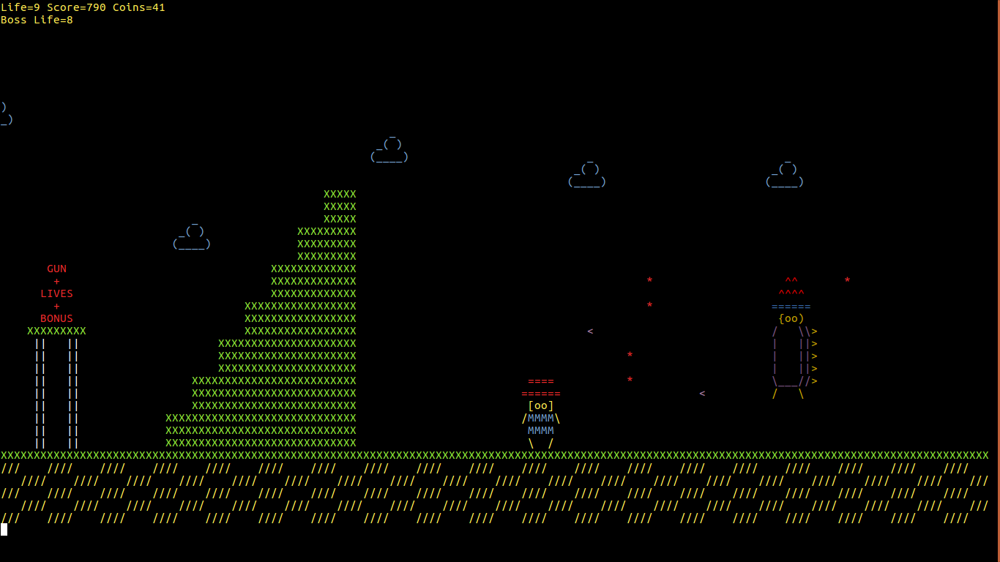
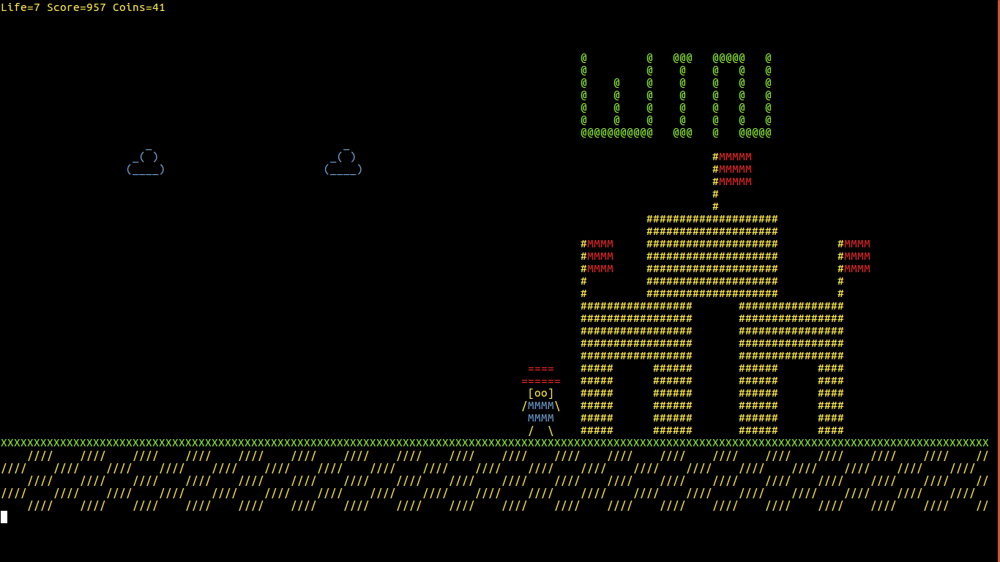

# Mario Game:

This is a mario game implemeted with python to play on terminal.

# System Requirements:
This game runs on Python3 and doesn't require any additonal libraries.  
# How To Play:

  - Run main.py
    
    ```sh
        $ python3 main.py
    ```
    
  - ### KeyBoard Inputs:
    - w=Jump
    - a=Backward Movment
    - d=Forward Movement
    - s=Go inside a Pipe
    - Space=Fire Bullets
    - q=Quit

    Initially the player has 5 lives. It can Collect Coins from Bricks. The number of coins in each Brick is wriiten on the brick. Player can kill enemeis by jumping on them.
    
  - ### Bridge:
    There is a bridge at a large pit which moves forward and backward.Player can stand on the bridge to cross the pit  
    
  - ### Bonus Level:
  - 
    There is a Bonus level which can be entered through a pipe. Player can have coins, Extra lives, and fire Power by playing this level. The Player **Must** enter this level in order to kill the BOSS. Player will also get Extra 5 lives.
    
  - ### BOSS:
     After Completing the Bonus Level Player will have Fire Power. The Boss Also has Bullets. If the Player Hits the Boss 10 times boss dies and Player wins.The Boss changes his position randomly. If Player gets too close to the boss player will lose a life. 
     If At Anytime a Player falls into pit or touches an enemy from sides it loses one life and is re spawned at the beginning. If Player has 0 life and loses one more the Game will be over 
     
     